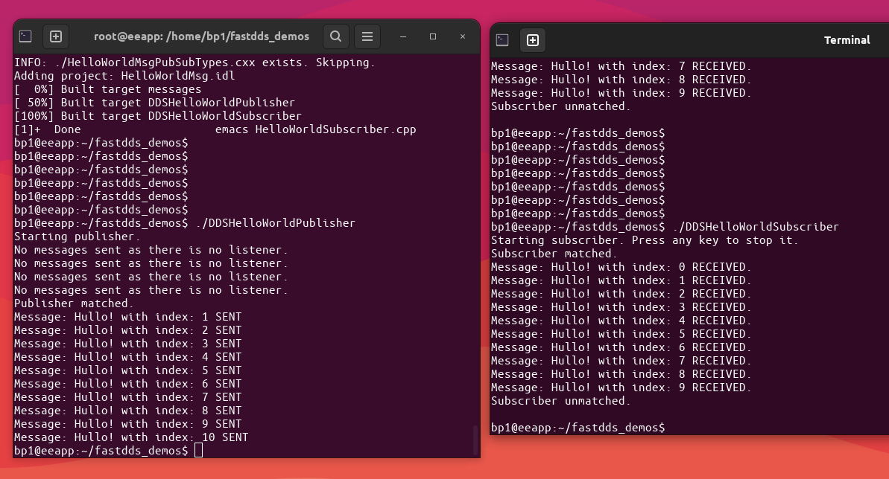

# FAST DDS Demo

Based on this tutorial: https://fast-dds.docs.eprosima.com/en/latest/fastdds/getting_started/simple_app/simple_app.html

It demonstrates a realtime publisher / subscriber application.



## Prereqisites

Fast CDR
```
apt install libfastcdr-dev
```

Fast RTPS
```
apt install libfastrtps-dev
```

Fast DDS tools
```
apt install fastddsgen fastdds-tools
```

## How to compile

```
cmake .
make
```


## How to run

Open a terminal and type
```
./DDSHelloWorldPublisher
```

Open another terminal and type

```
./DDSHelloWorldSubscriber
```
